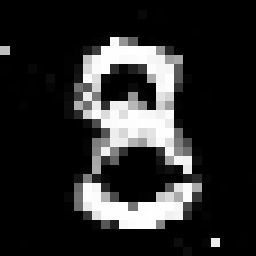
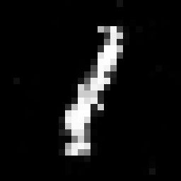

# PyTorch GANs :computer: :art:
This repo contains PyTorch implementation of Vanilla GAN architecture.  

## Table of Contents
  * [Understanding GANs](#understanding-gans)
  * [Vanilla GAN](#vanilla-gan)
    
---

## Understanding GANs

GAN stands for Generative Adversarial Networks, which is a type of deep learning model that consists of two networks: a generator and a discriminator. The generator network learns to generate realistic-looking fake data (e.g. images, audio, text) from random noise, while the discriminator network learns to distinguish the fake data from the real data. The two networks are trained simultaneously in an adversarial manner, where the generator tries to fool the discriminator by generating more realistic fake data, while the discriminator tries to correctly identify the real and fake data.

The original paper introducing GANs is titled [Generative Adversarial Networks](https://papers.nips.cc/paper/5423-generative-adversarial-nets.pdf) and was authored by Ian Goodfellow, Jean Pouget-Abadie, Mehdi Mirza, Bing Xu, David Warde-Farley, Sherjil Ozair, Aaron Courville, and Yoshua Bengio. It was published in 2014 at the Conference on Neural Information Processing Systems (NIPS).

GANs have two components:
1. <b>Generator Network:</b> The generator network takes a random noise vector as input and generates a new image.
2. <b>Discriminator Network:</b> The discriminator network takes an image as input and outputs a scalar value indicating whether the image is real or fake.

---

## Vanilla GAN

Vanilla GAN is my implementation of the original GAN paper with certain modifications mostly in the model architecture,
like the usage of LeakyReLU and 1D batch normalization.

### Examples
    
GAN was trained on data from MNIST dataset. Here is how the digits from the dataset look like:

    
    

---

## Acknowledgements

I've used the following repositories as reference for implementing my version:
* [pytorch-GANs](https://github.com/gordicaleksa/pytorch-GANs) (PyTorch)
* [PyTorch-GAN](https://github.com/ahmadchalhoub/research_implementations) (PyTorch)
